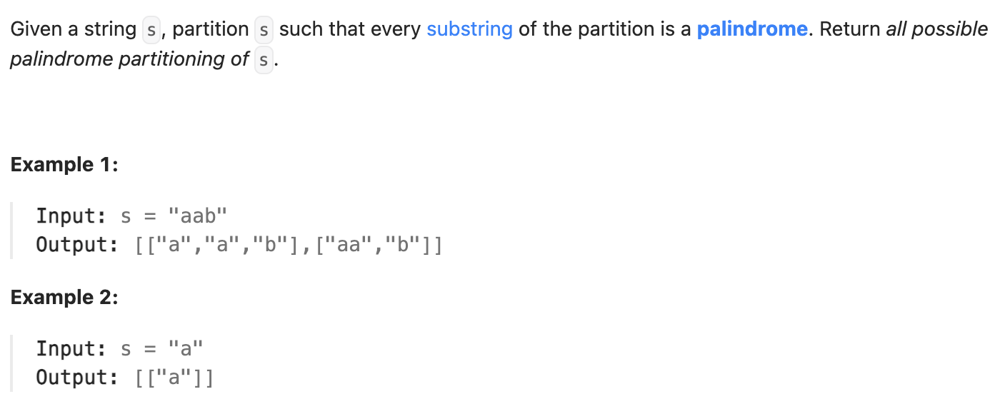

``` cpp
class Solution {
public:
    vector<vector<string>> partition(string s) {
        vector<vector<string>> combinations;
        vector<string> combination;
        dfs(combinations, combination, s, 0);
        return combinations;
    }

    void dfs(vector<vector<string>>& combinations, vector<string>& combination,
             string& s, int cur) {
        if (cur == s.size()) {
            combinations.push_back(combination);
        }
        // 从这一位开始一一枚举，把所有可能的都放进去
        for (int i = cur; i < s.size(); i++) {
            string sub = s.substr(cur, i-cur+1);
            string rev = sub;
            reverse(rev.begin(), rev.end()); // 注意reverse的用法是操作string
            if (sub == rev) {
                combination.push_back(sub);
                dfs(combinations, combination, s, i + 1);
                combination.pop_back();
            }
        }
    }
};
```
