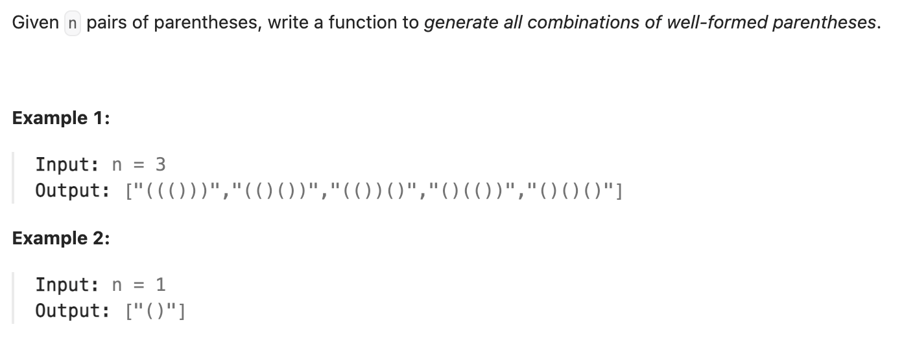

``` cpp
class Solution {
public:
    vector<string> generateParenthesis(int n) {
        vector<string> combinations;
        string combination;
        backtrack(combinations, combination, n, n);
        return combinations;
    }
    void backtrack(vector<string>& combinations, string& combination, int left,
                   int right) {
        if (right == 0) {
            combinations.push_back(combination);
            return;
        }
        if (left == right || left != 0) {
            combination.push_back('(');
            backtrack(combinations, combination, left - 1, right);
            combination.pop_back();
        }
        if (left < right) {
            combination.push_back(')');
            backtrack(combinations, combination, left, right - 1);
            combination.pop_back();
        }
    }
};
```
