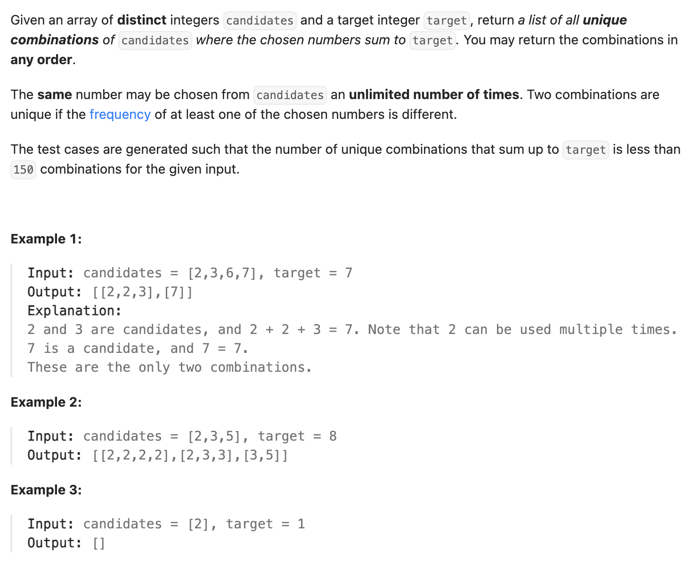

``` cpp
class Solution {
public:
    vector<vector<int>> combinationSum(vector<int>& candidates, int target) {
        sort(candidates.begin(), candidates.end()); //对原数组进行排序
        if (candidates[0] > target) {
            return {};
        }
        vector<vector<int>> combinations;
        vector<int> combination;
        backtrack(combinations, combination, target, candidates, 0, 0);
        return combinations;
    }

    void backtrack(vector<vector<int>>& combinations, vector<int>& combination,
                   int target, vector<int>& candidates, int index,
                   int currsum) {
        if (currsum == target) {
            combinations.push_back(combination);
            return;
        }

        // 每一位都试着加加看
        for (int i = index; i < candidates.size(); i++) {
            // 如果大了，就回退掉上一层
            // 比如4+6大于7，就会回退到把2去掉（6并没有加入队列）
            if (currsum + candidates[i] > target) {
                break;
            } else {
                combination.push_back(candidates[i]);
                currsum += candidates[i];
                backtrack(combinations, combination, target, candidates, i,
                          currsum);
                combination.pop_back();
                currsum -= candidates[i];
            }
        }
    }
};
```
