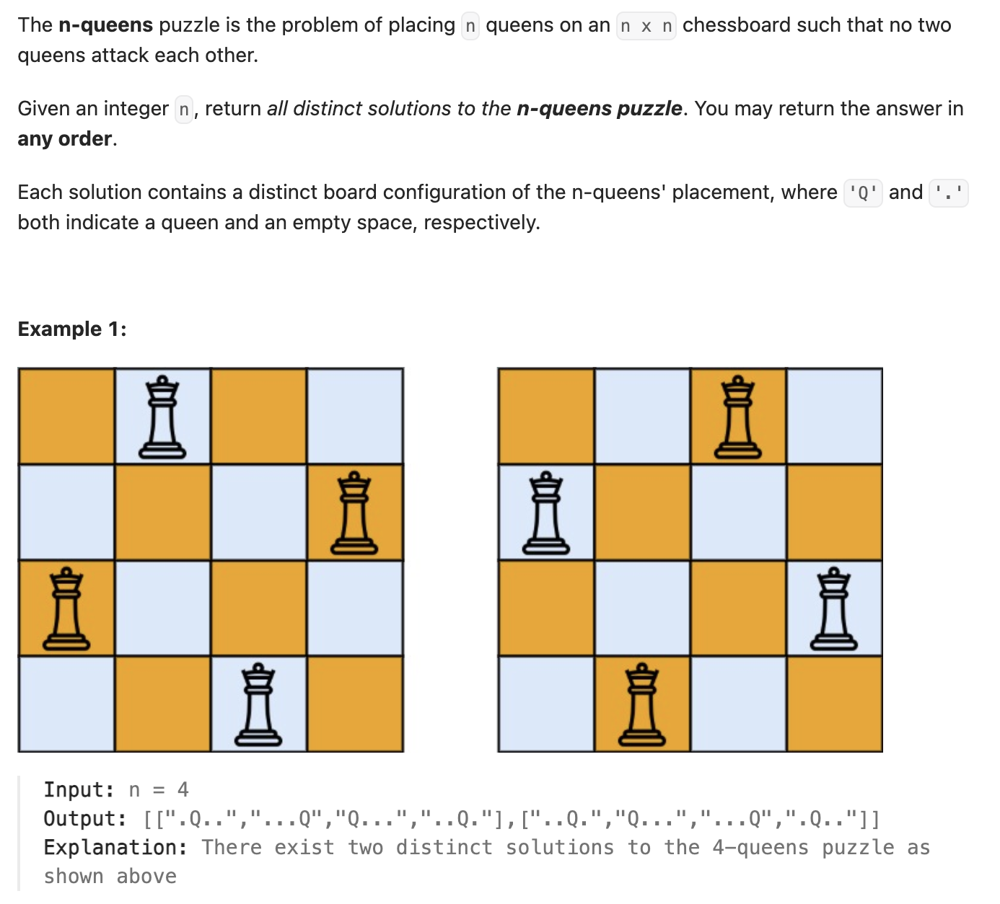

``` cpp
class Solution {
public:
    // 注意：这道题要求除了不能在同一行同一列，对角线也不行！！
    // 涉及到对角线的数学性质
    vector<vector<string>> solveNQueens(int n) {
        vector<vector<string>> combinations;
        vector<string> combination;
        vector<int> cols(n);
        vector<int> diag1(2 * n);
        vector<int> diag2(2 * n);
        backtrack(combinations, combination, n, cols, diag1, diag2);
        return combinations;
    }

    void backtrack(vector<vector<string>>& combinations,
                   vector<string>& combination, int& n, vector<int>& cols,
                   vector<int>& diag1, vector<int>& diag2) {
        int rowindex = combination.size();
        if (rowindex == n) {
            combinations.push_back(combination);
        } else {
            for (int colindex = 0; colindex < n; colindex++) {
                int d1 = rowindex - colindex + n;
                // 主对角线（左上到右下）的特征是row-col都相等
                // 所以只要diag1[i]一样，就在同一对角线上
                // 但是i不能小于0，所以+n
                int d2 = rowindex + colindex;
                // 副对角线（左下到右上）的特征是row+col都相等

                if (cols[colindex] | diag1[d1] | diag2[d2]) {
                    // 只要有一个1就不行
                    continue;
                }

                cols[colindex] = 1;
                diag1[d1] = 1;
                diag2[d2] = 1;
                string row(n, '.');
                row[colindex] = 'Q';
                combination.push_back(row);

                backtrack(combinations, combination, n, cols, diag1, diag2);

                combination.pop_back();
                cols[colindex] = 0;
                diag1[d1] = 0;
                diag2[d2] = 0;
            }
        }
    }
};
```
