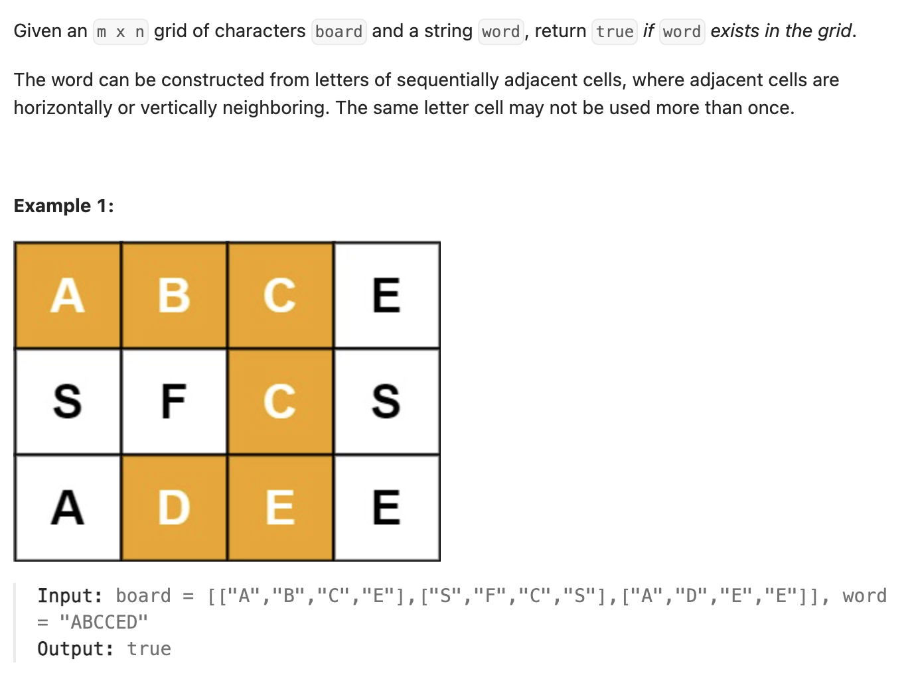

``` cpp
class Solution {
public:
    bool exist(vector<vector<char>>& board, string word) {
        // 每个位置的字母都可能作为开头，一一枚举
        for (int i = 0; i < board.size(); i++) {
            for (int j = 0; j < board[0].size(); j++) {
                if (backtrack(board, word, 0, i, j)) {
                    return true;
                }
            }
        }
        return false;
    }
    
    // 我认为&符号能打就打，可以避免复制参数，加快运行速度
    bool backtrack(vector<vector<char>>& board, string& word, int index, int row,
                   int col) {
        //正确的情况，重点是只要一个对就足够了
        if (board[row][col] == word[index]) {
            if (index == word.size() - 1) {
                return true;
            } else {
                // 注意！防止遍历的时候重复遍历字母！所以把当前字母临时改成#
                char temp = board[row][col];
                board[row][col] = '#';
                // 只要有一个遍历对了，就一路return true
                if (row > 0) {
                    if (backtrack(board, word, index + 1, row - 1, col)) {
                        return true;
                    }
                }
                if (col > 0) {
                    if (backtrack(board, word, index + 1, row, col - 1)) {
                        return true;
                    }
                }
                if (row < board.size() - 1) {
                    if (backtrack(board, word, index + 1, row + 1, col)) {
                        return true;
                    }
                }
                if (col < board[0].size() - 1) {
                    if (backtrack(board, word, index + 1, row, col + 1)) {
                        return true;
                    }
                }
                // 恢复当下的字母
                board[row][col] = temp;
            }
        }
        // 前面都未成功就return false
        return false;
    }
};
```

