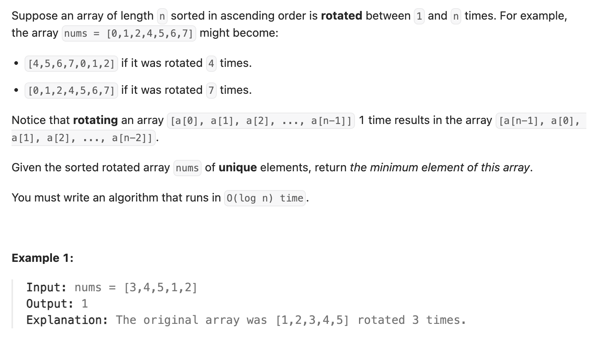

``` cpp
class Solution {
public:
    int findMin(vector<int>& nums) {
        // 其实就是找到转折点！
        // 可以通过mid和right比较大小来看转折点在哪一边

        int left = 0;
        int right = nums.size() - 1;
        while (left < right) {
            int mid = (left + right) / 2;
            // 先看右边。因为除非mid>right，不然一定在左边
            if (nums[mid] > nums[right]) {
                left = mid + 1;
            } else {
                right = mid;
            }
        }
        return nums[left];
    }
};
```
