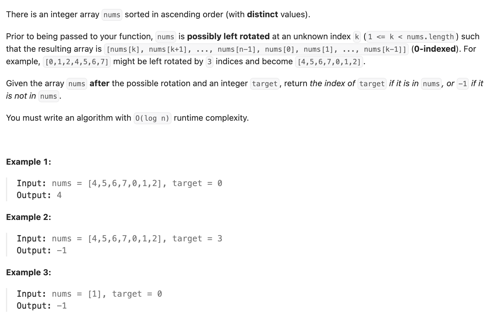

``` cpp
class Solution {
public:
    int search(vector<int>& nums, int target) {
        // 二分时，可以检查哪一遍有序的。判断target是不是在有序的一边。
        // 当然，可能两边都是有序的，这也无所谓。
        // 判断乱序和有序，只需要看mid和right的大小关系！！！
        // 如果mid>right，左半边有序；如果mid<=right，右半边有序

        if (nums.empty()) {
            return -1;
        }
        int left = 0;
        int right = nums.size() - 1;

        while (left <= right) {
            int mid = (left + right) / 2;
            if (nums[mid] == target) {
                return mid;
            }

            // 如果左边是有序的
            if (nums[mid] > nums[right]) {
                // 判断它是不是在左半边
                if (nums[left] <= target && nums[mid] > target) {
                    right = mid - 1;
                } else {
                    left = mid + 1;
                }
            }

            // 如果右边是有序的
            else {
                // 判断它是不是在右半边
                if (nums[mid] < target && nums[right] >= target) {
                    left = mid + 1;
                } else {
                    right = mid - 1;
                }
            }
        }

        return -1;
    }
};
```
