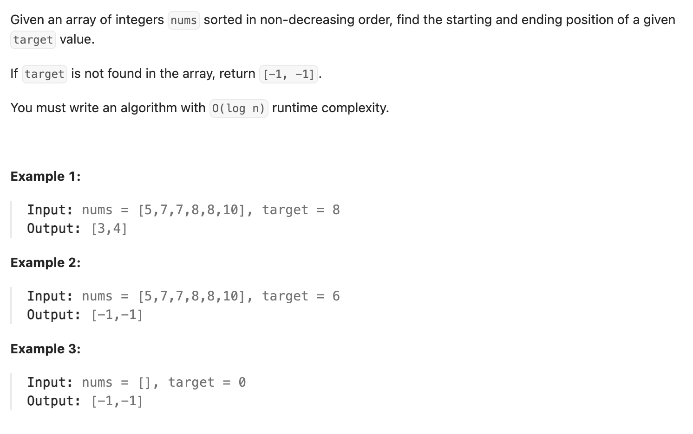

``` cpp
class Solution {
public:
    vector<int> searchRange(vector<int>& nums, int target) {
        if (nums.empty()) {
            return {-1, -1};
        }
        // 不要想着直接找到首位，转换为找单个数字！
        double t1 = target - 0.5;
        double t2 = target + 0.5;
        int pos1 = position(nums, t1);
        int pos2 = position(nums, t2) - 1; // -1后才是正确的最后一位target的位置
        if (pos1 <= pos2 && nums[pos1] == target) {
            return {pos1, pos2};
        } else {
            return {-1, -1};
        }
    }

    // 找到第一个 >=t 的位置
    // 例如，[5,7,7,8,8,10]里对7.5来说是3，对8.5来说是5
    int position(vector<int>& nums, double t) {
        int left = 0;
        int right = nums.size();
        while (left < right) {
            int mid = (left + right) / 2;
            if (nums[mid] < t) {
                left = mid + 1;
            } else {
                right = mid;
            }
        }
        return left;
    }
};
```
