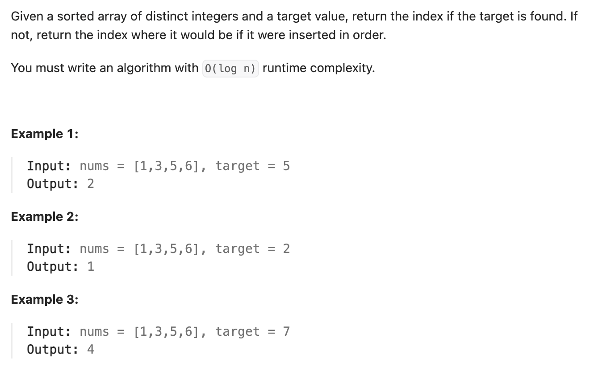

``` cpp
class Solution {
public:
    int searchInsert(vector<int>& nums, int target) {
        int left = 0;
        int right = nums.size();

        while (left < right) {
            int mid = (left + right) / 2; // 向下取整，例如2.5取2

            if (nums[mid] < target) {
                left = mid + 1; // 说明 mid 以及左边都太小，插入位置一定在右边
            } else {
                right = mid; // 说明 mid 可能就是答案，所以保留它
            }
            // 最后 left == right，就是第一个大于等于 target 的位置
        }

        return left;
    }
};
```
