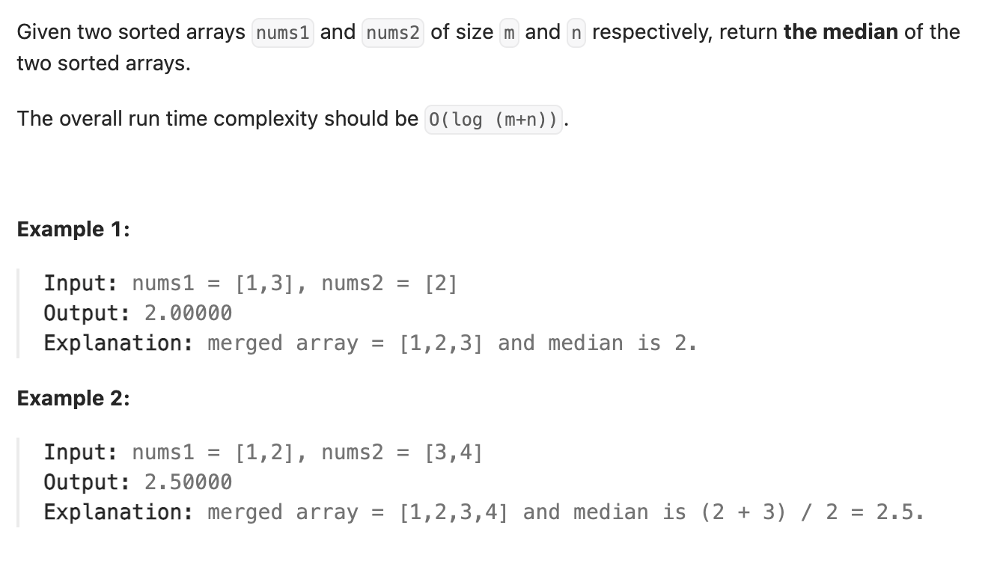

``` cpp
class Solution {
public:
    double findMedianSortedArrays(vector<int>& nums1, vector<int>& nums2) {
        // 首先计算出中位数所在的位置k
        // 把k/2,意欲分给两个数组
        // 比较该位置两个数组值的大小，对于小的来说，中位数一定在它之后
        // 减掉目前可以排除的数量，更新k

        int total_length = nums1.size() + nums2.size();
        int k = 0;
        if (total_length % 2 == 1) {
            k = total_length / 2 + 1;
            return findMedian(nums1, nums2, k, 0, 0);
        } else {
            k = total_length / 2;
            return (findMedian(nums1, nums2, k, 0, 0) +
                    findMedian(nums1, nums2, k + 1, 0, 0)) /
                   2;
        }
    }

    double findMedian(vector<int>& nums1, vector<int>& nums2, int k, int left1,
                      int left2) {
        // 结束条件是k=1或者有一边的长度为0
        while (left1 < nums1.size() && left2 < nums2.size() && k > 1) {
            int cut = k / 2;

            int mid1 = min(left1 + cut, (int)nums1.size()) - 1;
            int mid2 = min(left2 + cut, (int)nums2.size()) - 1;

            if (nums1[mid1] > nums2[mid2]) {
                k -= mid2 - left2 + 1;
                left2 = mid2 + 1;

            } else {
                k -= mid1 - left1 + 1;
                left1 = mid1 + 1;
            }
        }

        // 如果有一方长度为0，只看另一方就行
        if (left1 == nums1.size()) {
            return nums2[left2 + k - 1];
        } else if (left2 == nums2.size()) {
            return nums1[left1 + k - 1];
        }
        // 如果k=1，拿小的那个就行
        else {
            return min(nums1[left1], nums2[left2]);
        }
    }
};
```

图解：
.png)
.png)
.png)
