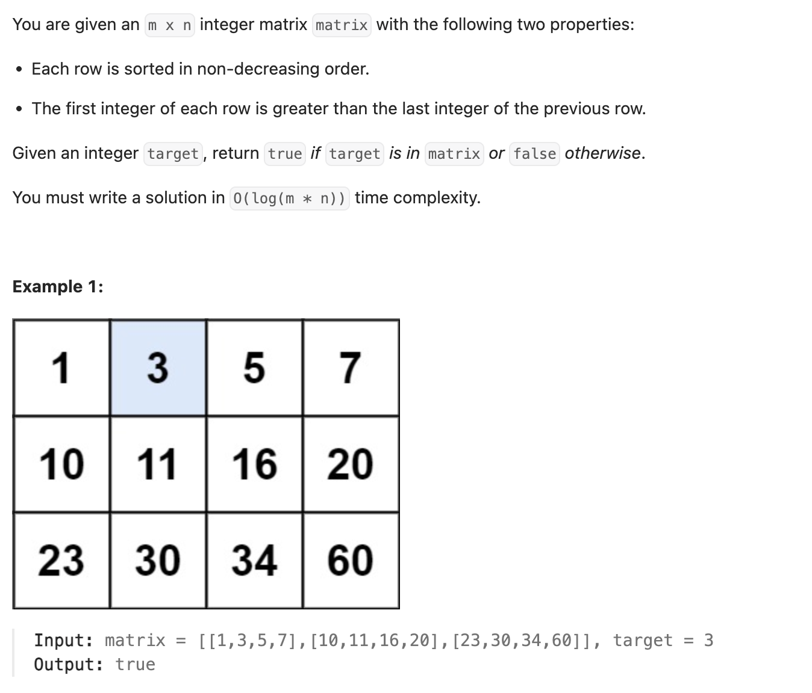

``` cpp
class Solution {
public:
    bool searchMatrix(vector<vector<int>>& matrix, int target) {
        int m = matrix.size();
        int n = matrix[0].size();

        int left = 0;
        int right = m * n - 1;
        // 把二维矩阵当成一维有序数组做一次二分!!

        while (left <= right) {
            int mid = left + (right - left) / 2;

            int row = mid / n; // 除以n的结果
            int col = mid % n; // 除以n的余数

            if (matrix[row][col] == target) {
                return true;
            } else if (matrix[row][col] < target) {
                left = mid + 1;
            } else {
                right = mid - 1;
            }
            // 注意：左右都是闭区间
        }

        return false;
    }
};
```
