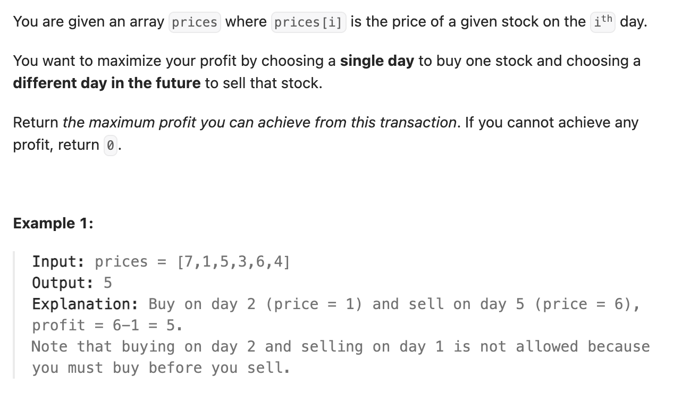

``` cpp
class Solution {
public:
    int maxProfit(vector<int>& prices) {
        // 前i天的最大收益 =
        // max{前i-1天的最大收益，第i天的价格-前i-1天中的最小价格}
        int res = 0;
        int m = prices[0]; // 前i位中的最小值
        for (int i = 0; i < prices.size(); i++) {
            res = max(res, prices[i] - m);
            m = min(prices[i], m);
        }
        return res;
    }
};
```
