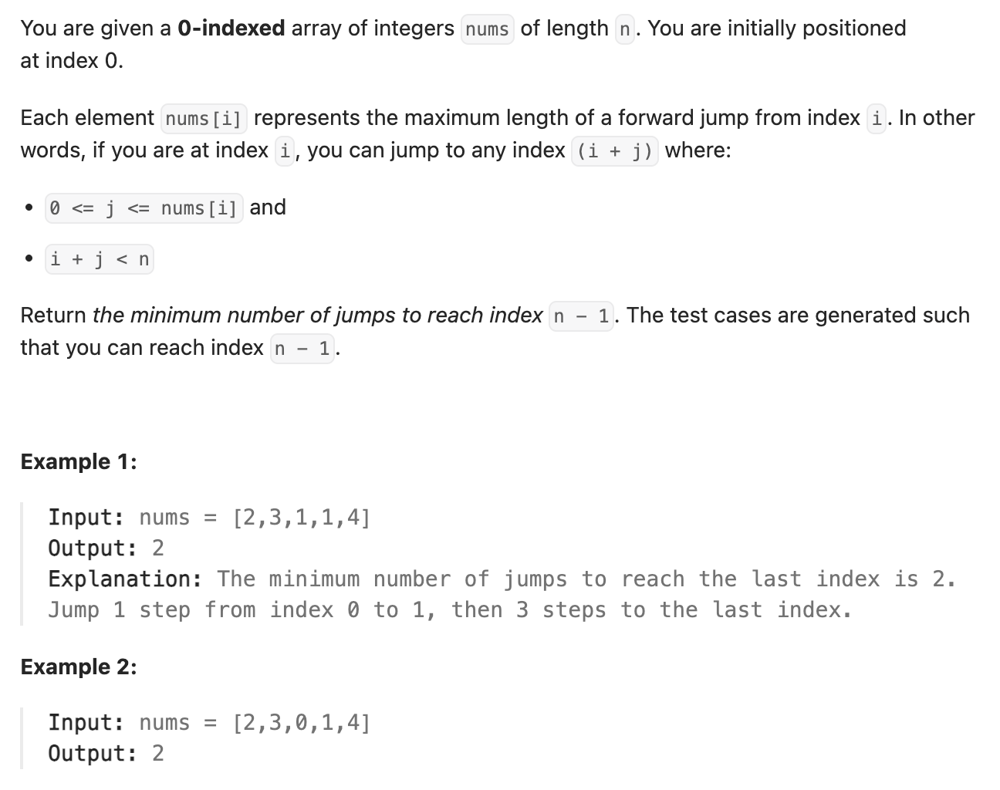

``` cpp
class Solution {
public:
    int jump(vector<int>& nums) {
	    // 分段跳，每一个段里(end)统计下一个段可以跳到的最远的地方（maxPos)
        int maxPos = 0; // 目前能跳到的最远的地方
        int n = nums.size();
        int end = 0; // 当前的step结束的地点
        int step = 0; // 最少跳跃数量
        for (int i = 0; i < n - 1; ++i) {
            maxPos = max(maxPos, i + nums[i]);
            // 如果到达本段末尾，加一步
            if (i == end) {
                end = maxPos;
                step++;
            }
        }
        return step;
    }
};
```
