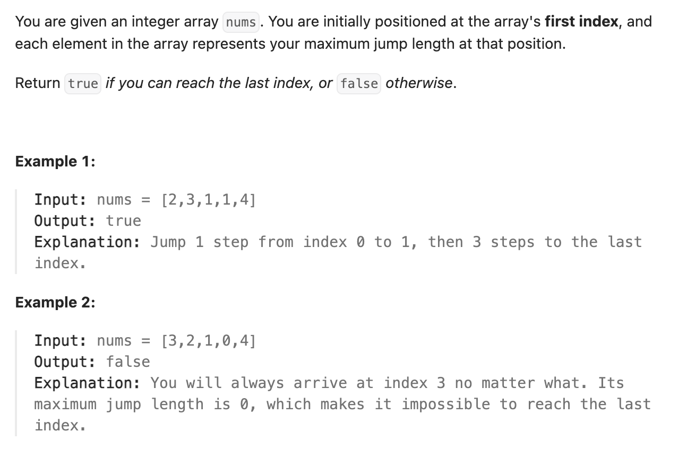

``` cpp
class Solution {
public:
    bool canJump(vector<int>& nums) {
        // 只要最远可到达的位置在末位之后就行
        int most_right = 0;
        for (int i = 0; i < nums.size(); i++) {
            // 达不到这一位，那肯定达不到更后面
            if (most_right < i) {
                return false;
            }
            most_right = max(most_right, nums[i] + i);
        }
        return true;
    }
};
```
