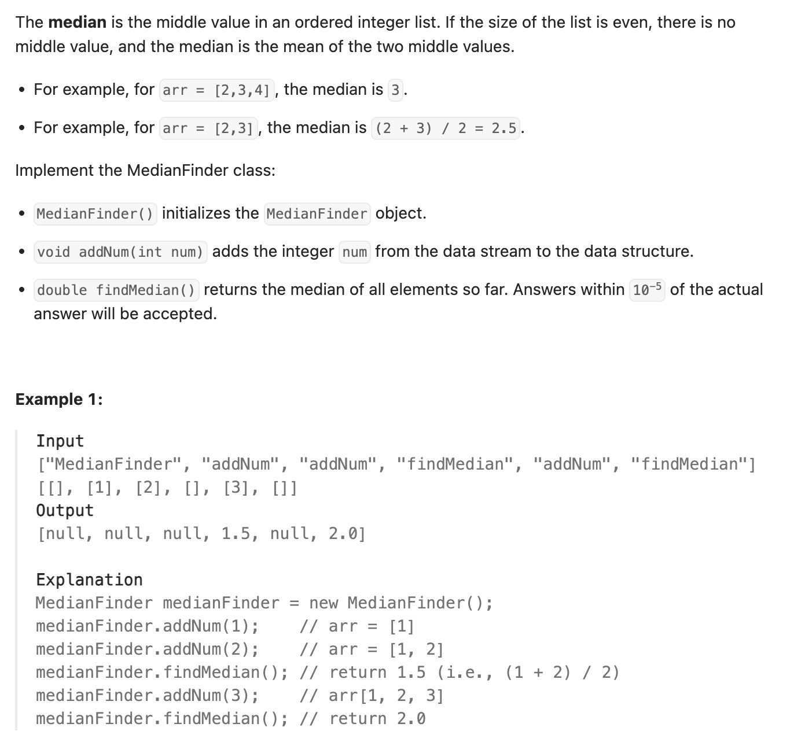

``` cpp
class MedianFinder {
private:
    // 左半部分，顶部是最大值
    priority_queue<int> left;
    // 右半部分，顶部是最小值
    priority_queue<int, vector<int>, greater<int>> right;

public:
    MedianFinder() {}

    void addNum(int num) {
        // 先放进left，把left最大值移到right，最后平衡大小
        left.push(num);
        right.push(left.top());
        left.pop();
        if (right.size() > left.size()) {
            left.push(right.top());
            right.pop();
        }
    }

    double findMedian() {
        if (left.size() == right.size()) {
            return (left.top() + right.top()) / 2.0; // 注意要除2.0而不是2
        } else {
            return left.top();
        }
    }
};

/**
 * Your MedianFinder object will be instantiated and called as such:
 * MedianFinder* obj = new MedianFinder();
 * obj->addNum(num);
 * double param_2 = obj->findMedian();
 */
```
