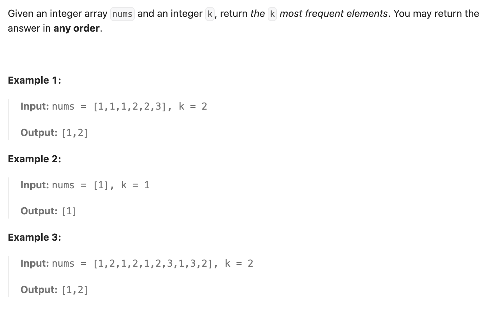

``` cpp
class Solution {
public:
    vector<int> topKFrequent(vector<int>& nums, int k) {
        // 制作哈希表，计算出现次数
        unordered_map<int,int> mp;
        for (int i = 0; i < nums.size(); i++) {
            mp[nums[i]]++;
        }

        // 放入堆
        priority_queue<pair<int, int>> pq;
        for (auto& p : mp) {
            // 会先看前一位，再看后一位
            pq.push({p.second, p.first});
        }

        vector<int> res;
        for (int j = 0; j < k; j++) {
            res.push_back(pq.top().second);
            pq.pop();
        }

        return res;
    }
};
```
