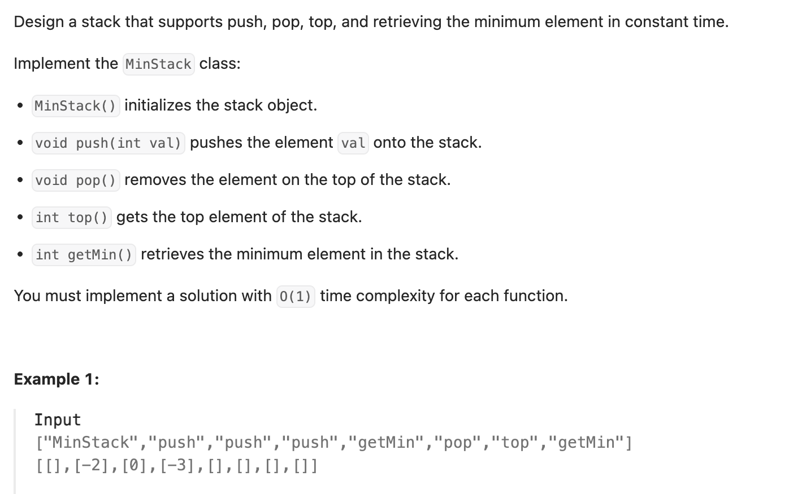

``` cpp
class MinStack {
private:
    stack<int> st;
    stack<int> min_st; // 辅助栈

public:
    MinStack() { min_st.push(INT_MAX); }

    // 当一个元素要入栈时，我们取当前辅助栈的栈顶存储的最小值，与当前元素比较得出最小值
    // 将这个最小值插入辅助栈中
    // 相当于记录了每个时刻的最小值是多少
    void push(int val) {
        st.push(val);
        if (val < min_st.top()) {
            min_st.push(val);
        } else {
            min_st.push(min_st.top());
        }
    }

    // 当一个元素要出栈时，把辅助栈的栈顶元素也一并弹出
    void pop() {
        st.pop();
        min_st.pop();
    }

    int top() { return st.top(); }

    // 在任意一个时刻，栈内元素的最小值就存储在辅助栈的栈顶元素中
    int getMin() { return min_st.top(); }
};

/**
 * Your MinStack object will be instantiated and called as such:
 * MinStack* obj = new MinStack();
 * obj->push(val);
 * obj->pop();
 * int param_3 = obj->top();
 * int param_4 = obj->getMin();
 */
```
