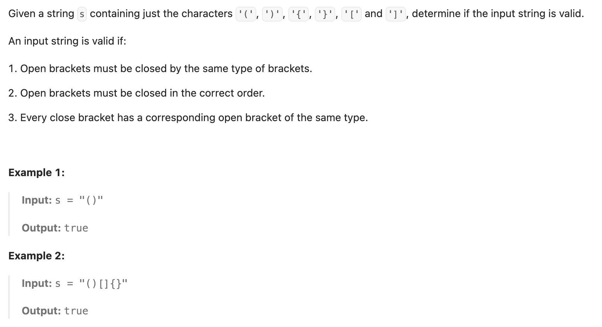

``` cpp
class Solution {
public:
    bool isValid(string s) {
        // 用栈来存放，左括号插入，右括号提取左括号
        if (s.size() == 0) {
            return true;
        }
        stack<char> st;
        for (int i = 0; i < s.size(); i++) {
            // 如果是左括号，加入
            if (s[i] == '(' || s[i] == '{' || s[i] == '[') {
                st.push(s[i]);
            } else if (!st.empty()) {
                // 如果非空，且是右括号，分类看对不对
                if (s[i] == ')' && st.top() == '(') {
                    st.pop();
                } else if (s[i] == '}' && st.top() == '{') {
                    st.pop();
                } else if (s[i] == ']' && st.top() == '[') {
                    st.pop();
                } else {
                    return false;
                }
            } else {
                return false;
            }
        }
        
        // 如果st空，说明都遍历完成，正确
        if (st.empty()) {
            return true;
        }
        return false;
    }
};
```