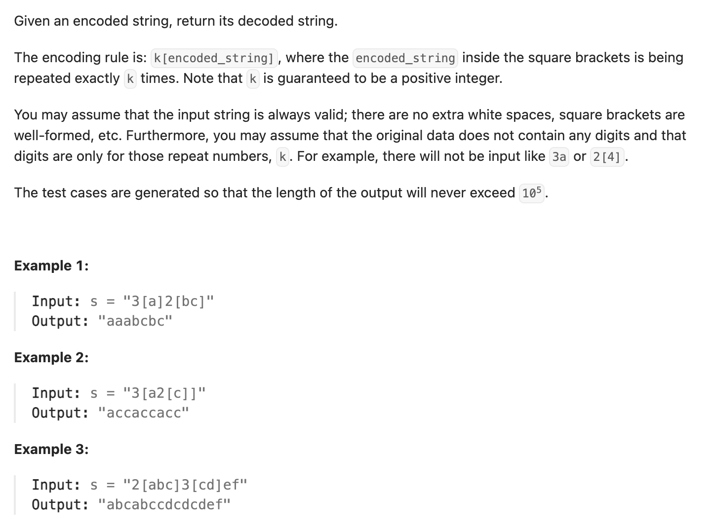

``` cpp
class Solution {
public:
    string decodeString(string s) {
        // 一个栈用来存数字，一个栈用来存字符串
        stack<int> num_st;
        stack<string> str_st;
        // 一个变量用来存当前捕捉到的数字，一个变量用来存当前捕捉到的字符串
        string cur_int;
        string cur_str;
        int cur_int2;

        int i = 0;
        while (i < s.size()) {
            // 如果是数字，往cur_int填写
            if (isdigit(s[i])) {
                cur_int += s[i];
                i++;
            }

            // 如果是字母，往cur_str填写
            else if (s[i] != '[' && s[i] != ']') {
                cur_str += s[i];
                i++;
            }

            // 如果看到[，把当前捕捉的数字和字符串推到栈里，清空两个变量
            else if (s[i] == '[') {
                // num_st一定不会是空，因为[]前面一定有数字
                num_st.push(stoi(cur_int)); // 字符串转数字
                cur_int.clear();
                // str_st可能是空，但是表示[]前面的全部字符，空也是一种
                str_st.push(cur_str);
                cur_str.clear();
                i++;
            }

            // 如果看到]，把cur_str重复num_st.top遍
            // 然后带上前面的string（也就是str_st.top()），贴回到cur_str上
            else if (s[i] == ']') {
                cur_int2 = num_st.top();
                num_st.pop();

                string copy;
                for (int j = 0; j < cur_int2; j++) {
                    copy += cur_str;
                }

                cur_str = str_st.top() + copy;
                str_st.pop();

                i++;
            }
        }
        return cur_str;
    }
};
```
