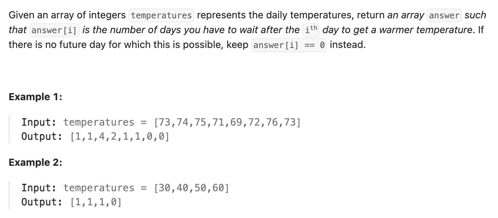

``` cpp
class Solution {
public:
    vector<int> dailyTemperatures(vector<int>& temperatures) {
        // 存一个单调栈，用来存下标，这样就可以就可以根据下标差计算天数了！
        stack<int> st;
        st.push(0);

        vector<int> res(temperatures.size());

        for (int i = 1; i < temperatures.size(); i++) {
            while (!st.empty() && temperatures[i] > temperatures[st.top()]) {
                // 查看两者下标差是多少
                res[st.top()] = i - st.top();
                st.pop();
            }
            st.push(i);
        }

        return res;
    }
};
```
