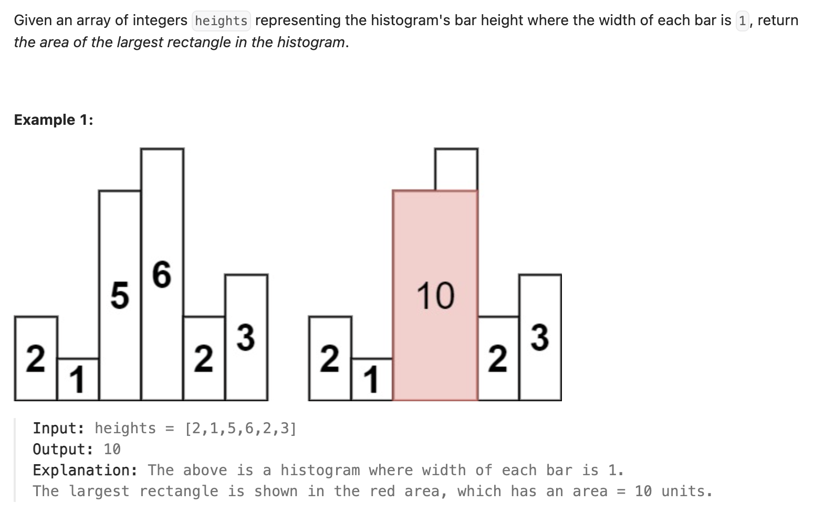

``` cpp
class Solution {
public:
    int largestRectangleArea(vector<int>& heights) {
        // 对数组中的每个元素，若假定以它为高，能够展开的宽度越宽，那么以它为高的矩形面积就越大
        // 找到每个元素左边第一个比它矮的矩形和右边第一个比它矮的矩形，在这中间的就是最大宽度
        // 对每个元素遍历一遍找到最大值即可

        // 使用单调栈，从上往下递减
        // 当看到一个新的数，如果比栈顶大，就放入，如果比栈顶小，就依次取出栈顶，计算每个矩形面积
        stack<int> st;
        st.push(-1);
        int res = 0;
        for (int i = 0; i < heights.size(); i++) {
            // 如果比栈顶大，就放入
            if (st.top() != -1 && heights[st.top()] <= heights[i]) {
                st.push(i);
            } else {
                while (st.top() != -1 && heights[st.top()] > heights[i]) {
                    int current = heights[st.top()]; // 当前计算的高度
                    st.pop();
                    // 计算属于这个高度的面积
                    int area = current * (i - st.top() - 1);
                    if (area > res) {
                        res = area;
                    }
                }
                st.push(i);
            }
        }

        // 计算残余栈内的面积
        while (st.top() != -1) {
            int current = heights[st.top()];
            st.pop();
            int area = current * (heights.size() - st.top() - 1);
            if (area > res) {
                res = area;
            }
        }

        return res;
    }
};
```
